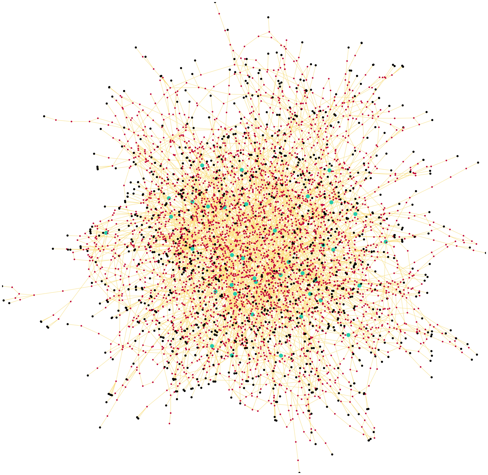

# US Power Grid Analysis
Analysis of the network "Power Grid US"

This undirected network contains information about the power grid of the Western States of the United States of America. An edge represents a power supply line. A node is either a generator, a transformator or a substation.

The document for the analysis is _Analysis of networl.pdf_, all the code used to analyze the network is inside _Analysis.ipynb_

## References
The dataset used was compiled by D. Watts and S. Strogatz
> [Collective dynamics of ‘small-world’ networks, D. J. Watts and S. H. Strogatz, Nature 393, 440-442 (1998)](https://www.nature.com/articles/30918.pdf)